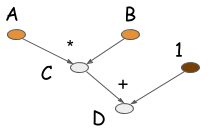
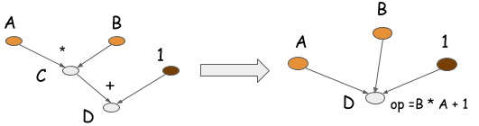
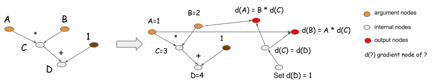

# Deep Learning Paogramming Style

然而我们最终关心的是效率，在我们开始担心优化之前我们首先需要写代码。写清晰、直观的深度学习代码是有挑战性的。对于任何参与人的第一件事是解决使用哪种语言规则。很多深度学习库有自己的使用方式。

在这个文档中，我们集中在两个最重要的高等级设计决策。

	1. 为了数学计算是否去接受符号化或者命令范式
	2. 是否构建更大或者更原子操作的网络。

最终，我们将集中在它们自身的项目模型上。当项目风格决策可能影响效率，我们指出这个，但是我们不会深究具体细节。

## Symbolic VS Imperative Programs

如果你是一个Python或者 C++的程序开发者，那么你已经熟悉命令程序。 命令风格的程序运行的时候是很高效的。你写的很多代码都是命令。

```
import numpy as np
a = np.ones(10)
b = np.ones(10) * 2
c = b * a 
d = c + 1
```

当这个项目执行 c = b * a，它运行实际的数字计算。

符号化项目有些不同。随着符号化风格项目，我们首先抽象的定义一个函数。当定义了这个函数，并没有实际的数值计算发生。我们定义的抽象函数以占位符值为单位。之后我们编译这个函数，并给予真实的输入来验证它。在接下来的例子中，我们使用之上介绍的字符式程序来重写了命令式程序：

```
A = Variable('A')
B = Variable('B')
C = B * A
D = C + Constant(1)

#编译这个函数 
f = compile(D)
d = f(A=np.ones(10), B=np.ones(10)*2)
```

正如你看到的，在符号化版本中，当 执行 C ＝ B ＊ A时，没有发生计算。反而，这个操作生成一个代表计算的计算图（也叫做符号图） 。接下来图展示了一个计算到D的计算图。



大部分符号化程序包含一个显式的或者隐式的编译步骤。传换一个计算图到一个函数中为我们之后提供调用。在上面的例子中，数值计算仅仅在最后一行代码发生。这种符号化程序的特性是它们清晰的把构建计算图和执行之间分离。对于神经网络，我们定义整个模型作为一个单独的计算图。

大多数其他流行的深度学习库中，Torch、Chiner和Minerva 使用的是命令式风格。符号化风格的深度学习库包括 Theano、CGT和TensorFlow。我们也可以看到类似于仅仅依赖于配置文件的CXXNet和Caffe，作为符号化风格的库。在这里说明，我们将考虑配置内容文件作为定义计算图。

现在你已经理解了两种程序语言模型之间的区别，来让我们对比下它们的优势。

##Imperative Pragrams Tend to be More Flexible

当你使用命令式风格的python库时，你正在写python。几乎所有的事情都会用python直观的写出，你能够快速的在命令式深度学习库的恰当的地方暂停。另一方面，当你写一个符号式程序的时候，你可能无法获得所有熟悉的python 结构，像迭代器。考虑接下来了的命令式程序，思考下怎样把它翻译成一个符号化程序。

```
a = 2
b = a + 1
d = np.zeros(10)
for i in range(d):
	d += np.zeros(10)
```
如果符号化API不支持python的for 循环，这将会很苦难。当你用python来写一个符号化程序时，你不能用python写。相反，你可是使用符号化API定义的领域具体化语言（DSL）来写。深度学习库中发明的符号化API是强有力的DSL ，它能为神经网络生成可调用的计算图。

事实上，你可能会说，命令式程序比符号化程序更本土化。更容易使用本土化语言特性。例如，它可以直接打印出中间计算的值或使用本地控制流和在计算流中任何点的循环。

## Symbolic Programs Tend to be More Efficient

正如我们看到的，命令式程序倾向于灵活性以及更好的适应一门主要的项目语言。所以你可能会想，为什么如此多的深度学习库要使用符号化样式？主要原因是效率，包括内存和速度。让我们在回头看下之前的例子：

```
 	import numpy as np
    a = np.ones(10)
    b = np.ones(10) * 2
    c = b * a
    d = c + 1
    ...
```


假设在数组中的每个细胞占用8位内存。我们用python终端需要多少内存来执行这个程序？

作为一个命令式程序，我们需要为每一行分配内存。这我们需要分配4个大小为10的数组。所以我们需要 4 ＊ 10 ＊ 8 ＝ 320 字节。另一方面，如果我们构建一个计算图，提前知道我们仅仅需要 d，我们能够为中间值重复使用内存来进行分配。例如，通过操作计算位置，我们可以回收利用分配给B的字节数来存储c。我们可以回收利用分配给c的字节数来存储d。最后我们能够剪切掉一半的内存需求，需求仅仅是 2 ＊ 10 ＊ 8 ＝ 160 字节。

符号化语言的限制更高。当我们在D上调用 compile 时， 我们告诉系统，仅仅d的值时需要的。计算的中间值，例如出，我们时看不到的。

我们获益与符号化程序安全的为位置计算的内存进行重利用。但是另一方面，如果我们之后决定我们需要获取c值，我们是很不幸的。所以命令式程序对于遇到的所有需要有更好的准备。 如果你在python终端中运行命令式版本的代码，我们将可以在未来检查任何中间值。

符号化程序也有另一种优化，叫做造作折叠。返回我们之前的例子，乘法和加法操作能够被折叠进一个操作中，就像下面图所展示的。如果这个计算图运行在一个GPU处理器上，一个GPU核将被执行，而不是两个。事实上，这是一种手工操作的优化库，像CXXNet和Caffe。操作折叠提升了计算效率。



注意，你不能在命令式程序中使用操作折叠，因为中间值在未来可能被引用。操作折叠在符号化程序中式可行的，因为你获得了一个完整的计算图，以及明晰的知道将来那些值是需要的，那些值是不需要的。

## Case Study: Backprop and AutoDiff

在这节中，我们用自动求导和反向传播来对比这两个程序模型。在深度学习中因为我们训练模型的机制导致求导是至关重要的。在任何神经网络模型中，我们定义一个损失函数，一个损失函数测量模型理想输出的距离。我们在每一步中更新模型参数的最小损失。为了决定更新参数的方向，我们需要在参数上取损失函数的导数。

在过去，某个人不管什么时候定义一个新模型，都需要手动求出导数计算。尽管数学是直观的，但是对于复杂的模型，这可是费时费力的工作。所有的深度学习库使得参与者／研究人员通过自动解决梯队计算问题变的更佳容易。

命令式和字符型语言都能执行剃度计算。所以让我们来看下你怎样让他们自动执行求导。

让我们用命令式程序开始。接下来的python代码的例子使用自动求导来作为我们的例子：

```
	class array(object) :
        """Simple Array object that support autodiff."""
        def __init__(self, value, name=None):
            self.value = value
            if name:
                self.grad = lambda g : {name : g}

        def __add__(self, other):
            assert isinstance(other, int)
            ret = array(self.value + other)
            ret.grad = lambda g : self.grad(g)
            return ret

        def __mul__(self, other):
            assert isinstance(other, array)
            ret = array(self.value * other.value)
            def grad(g):
                x = self.grad(g * other.value)
                x.update(other.grad(g * self.value))
                return x
            ret.grad = grad
            return ret

    # some examples
    a = array(1, 'a')
    b = array(2, 'b')
    c = b * a
    d = c + 1
    print d.value
    print d.grad(1)
    # Results
    # 3
    # {'a': 2, 'b': 1}
```

在这个代码中，每个数组对象包含一个剃度函数，当你运行 d.grad ，它将对剃度函数的输入进行递归，反向剃度值反悔和反回每个输入的剃度值。

这个看上去可能有点复杂。所以让我们用符号化程序来思考下剃度计算。接下来的程序使用符号化剃度计算来进行同样的任务。

```
A = Variable('A')
B = Variable('B')
C = B * A
D = C + Constant(1)
#get gradient node
gA, gB = D.grad(wrt=[A, B])
#compiles the gradient function
f = compile([gA,gB])
grad_a, grad_b = f(a=np.ones(10), B=np.ones(10)*2)

```
D 的剃度函数生成一个后向计算图，并返回一个剃度节点，gA，gB，它们对应下面图中的红色节点。



命令式程序实际上和符号式程序做了同样的事情。它隐式的在剃度闭包中保存了一个后向计算图。当你调用 d.grad 时，你从d（D）开始，通过图源路返回来计算剃度并收集结果。

剃度计算在符号式和命令式程序中遵循同样的方式。那他们的差异是什么？回忆下命令式程序准备遇见所有可能的需要。如果你创建了一个数组库来支持自动求导，你必须保持剃度闭包一直计算。这意味着没有历史变量被垃圾回收因为涉及到的变量d一直在函数闭包中。

如果你想要计算的仅仅是d值，而不是他的剃度怎么办？在符号式程序中，你用 f＝compiled([D]) 来声明。 这夜声明计算绑定，告诉系统你想要的仅仅是前向计算。结果，系统能够节省之前的内存，并在输入和输出之间共享内存。

图像运行在一个有n层的深度神经网络中。如果你仅仅运行一个前向，而没有一个后向剃度，你需要分配仅仅两份临时空间的副本来存储中间层的值，来代替n份副本。然而，命令式语言必须准备遇到所有可能的获得剃度的需求，他们必须存储中间值，所以他们需要n份临时空间副本。

正如你所看到的，优化等级上严格的依赖于你要做什么。符号式程序要求你在编译图式清楚这些细节。另一方面，命令式程序准备一个宽广范围的需求。符号式程序的天然优势在于它知道你想做什么，不想做什么。

我们有办法修改命令式程序以纳入类似的限制。例如，一个方案对于之前的问题是去介入一个上下文变量。你可以引入一个非剃度的上下文变量来关闭剃度计算。

```
with context.NoGradient():
	a = array(1, 'a')
	b = array(2, 'b')
	c = b * a
	d = c + 1
```
然而这里例子仍需要准备遇见所有可能的需求，这意味着你在前向传播中不能重复使用内存来操作位置计算。这个技术我们已经讨论产生一个显式的后向传播。许多库例如Caffe和CXXNet在同样的图中使用隐式后向操作。我们在这一章节讨论并应用他们。

大部分基于文件的配置库，像是CXXNet 和Caffe 设计来满足一个或两个通用需求：活的没层的激活或者活的所有权重的剃度。这些库有同样的问题：基于同样的数据结构，库支持越普遍，你能做的优化也越少。

你可以看到，大大多数情况下，限制和灵活性的这种是相同的。

## Model Checkpoint

能过保存模型在之后可以加载它是非常重要的。这有不同的方式来保存你的工作。普通情况下，保存一个神经网络，你需要保存两件事：一个神经网络的配置结构和神经网络的权重

监测配置的能力是符号化程序的一个优势。因为符号化构造阶段不执行计算，你能过直接序列化计算图，并在之后加载它。这解决了没有引入一个额外层保存配置的问题。

```
    A = Variable('A')
    B = Variable('B')
    C = B * A
    D = C + Constant(1)
    D.save('mygraph')
    ...
    D2 = load('mygraph')
    f = compile([D2])
    # more operations
    ...
```
因为在一个命令式程序执行时，你需要保存代码自身作为配置或者在命令式语言的顶部构建一个配置层。

## Parameter Updates

大部分符号化语言时数据流计算图。数据流图描述计算。怎样使用图来描述参数更新却不明显。这是因为参数更新是可变的，这不是数据流图的概念。大部分符号化语言引入一个特殊的更新机制来更新程序中的不变状态。

在命令式程序中进行参数更新是容易的，尤其是当涉及到每个之间多次更新。对于符号化语言，当你调用时也可以执行更新状态。所以在这种情况下，大多数符号化深度学习库会后退命令行方法来执行更新操作。

## There is No Strict Boundary

对比两种程序风格，我们的许多争论可能不实真的对。然而，这两种架构风格是非常有用的，尤其是对于理解不同中深度学习库。我们可以合理的总结下，这两种程序风格没有明显的界限。

## Big Vs Small Operations

当设计深度学习库时，另一种重要的程序模型是去支持哪种操作。通常，大多数深度学习库都支持两种操作：
 
 * 大运算：典型的是神经网络层计算。（例如全链接）
 * 小运算：像是矩阵乘法和元算相加这样的数学功能

像是CXXNet和Caffe这样的库支持层级计算。Theano和Minerva这样的库支持细粒度的计算。

## Smaller Operations Can Be More Flexible

常规的使用小计算来组成大计算。例如，sigmod单元能够由一个除法。加分和指数组成。

```
    sigmoid(x) = 1.0 / (1.0 + exp(-x))
```

你可以使用小计算来构建你想要的任何事情。如果你非常熟悉CXXNet或者Caffe风格的层。注意，除了他们很小之外这些操作与层不同，

```
    SigmoidLayer(x) = EWiseDivisionLayer(1.0, AddScalarLayer(ExpLayer(-x), 1.0))
```

这种表达组成三层，每次都定义了前向和后向剃度函数。使用更小的操作方便层的快速构建，因为你仅仅需要组合这些组件。

## Big Operations Are More Efficient

直接组合sigmod层需要三层的操作，而不是一层。

```
    SigmoidLayer(x) = EWiseDivisionLayer(1.0, AddScalarLayer(ExpLayer(-x), 1.0))
```
此代码为计算和内存创建开销。

像CXXNet和Caffe这样的库有不同的方法。为了支撑粗力度运算，像是批正则化和sigmoide层。在每一层，计算内核是手工编写的一个或一些CUDA内核启动。这使得执行更佳高效。

## Compilation and Optimization

当然，小计算可以被优化。让我们来看下执行引擎的优化部分。在执行图中有两种优化可是操作。

* 内存位置优化，在中间计算时重复使用内存。
* 算子融合，监测子图模式，像时sigmod，将他们融合成更大的计算核。

