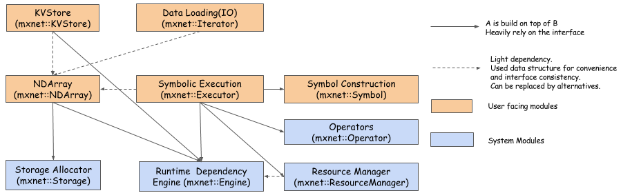

# MXNet System Architecture



这幅图展示了MXNet 系统主要模块和组成以及它们之间的交互。这些模块是：

* Runtime Dependency Engine： 根据它们的读写依赖进行调度和执行操作。
* Storage Allocator：从CPU和GPU设备有效的分配和回收内存块。
* Resource Manager： 管理像随机数运算符和临时空间这样的全局资源。
* NDArray： 动态、异步n纬数组为MXNet提供灵活的命令程序。
* Symbolic Execution：静态符号图执行器，提供有效的符号图执行和优化。
* Operator：定义静态前向和剃度累计的运算符。
* SimpleOp： 用一种特别的方式来扩展NDArray运算符和符号运算符。
* Symbol Construction：提供一种方式构建一个计算图。
* KVStore：高效参数同步的键－值存储接口。
* Data Loading(IO)：高效的数据加载和augmentation。

## MXNet 系统组件

### Execution Engine

你不仅仅可以把MXNet的引擎用于深度学习，还可以用于任何具体问题领域。它设计是用来解决一个普遍的问题：按照它们的依赖执行一系列函数。执行任何两个依赖函数都需要进行序列化。没有依赖的函数可以并行执行来提升效率。这篇文章的讨论可以看这里。

### Interface

执行引擎的核心接口：

```
   virtual void PushSync(Fn exec_fun, Context exec_ctx,
                          std::vector<VarHandle> const& const_vars,
                          std::vector<VarHandle> const& mutate_vars) = 0;
```

这个API允许你将一个函数（exec_fun）,连同它的上下文信息和依赖信息推送到到引擎中。exec_ctx 是执行exec_fun 函数的上下文信息， const_vars 表示这个函数读的变量，mutate_vars 被修正的变量。引擎提供以下保证：

```
修正公共辩论的任何两个函数的执行都是序列化的。
```

###Function

引擎的函数类型：

```
  using Fn = std::function<void(RunContext)>;
```

RunContext 包含了由引擎决定的运行时信息

```
 struct RunContext {
        // stream pointer which could be safely cast to
        // cudaStream_t* type
        void *stream;
    };

```

可选的，你可以使用 mxnet::engine::DAGEngine::Fn 是同样类型的定义。

所有的函数都是由引擎内部线程执行。像一个模型，通常没有一个很好的方法推送堵塞函数到引擎中，因为它将占据执行线程并减少总带宽。在这个案例中，我们提供了另一个异步函数类型：

```
using Callback = std::function<void()>;
using AsyncFn = std::function<void(RunContext, Callback)>;
```

在 AsyncFn 函数中，你能够将繁重部分任务传递到你自己的线程并安全的退出函数体。这个函数直到接收到 Callback 函数的回调之后才认为函数结束。

### Context

你可以明确的指出需要执行的函数的 Context。 这通常包括 这个函数是否应该运行在一个CPU或者一个GPU、是否明确指出要使用的GPU。 Context 不同与 RunContext。
Context 包括设备类型（GPU／CPU）和设备号，然而 RunContext 包含的信息仅仅在运行时才能被决定。例如，应该在那个流上执行函数。

### VarHandle

VarHandle  用来具体指出函数的依赖。MXNet 引擎为了与其他MXNet模块解耦而设计。所以 VarHandle 像是一个被提供的引擎允许你使用和修改外部资源函数。设计上是轻量化的，所以创建、删除或者拷贝一个变量需要很少的开销。在正在推送的函数上，你需要明确指出不可变的变量 const_vars .和 可以修改的变量 mutate_vars. 引擎使用来解决函数间依赖的一个规则：

```
执行任何两个函数当它们中的一个函数被修改时，至少一个共享变量应该在推送序列中被序列化
```

例如： 如果 Fn1 和 Fn2 都有 可变的 V2， 如果 Fn1 在 Fn2 之前，那么Fn2 需要保证在Fn1 之后执行。另一方面，如果 Fn1 和 Fn2 都是用 V2， 它们真实的执行顺序时随机的。

这种设计允许引擎使用最小化分配新内存的方式来调度状态可变操作。例如，在DNN中的权重更新函数，现在使用 ＋＝ 运算符来更新权重，而不是每次生成一个新的权重数组。

使用 NewVar（） API 来创建一个变量。 使用 PushDelete API 来删除一个变量。

### Push and Wait

所有的 Push API都是异步的。不管推送的 Fn 是否完成，API调用都会立刻返回。这允许引擎能够与用户线程正在推送的函数同时执行。 Push API 不是线程安全的。 具体来说，在调用引擎API时仅仅有一个线程在执行。

如果你想等在一个具体的 Fn 结束，包括在闭包中的回调函数，和 调用Fn结尾的函数。

如果你想所有 Fn 都等待一个特定变量完成，可以使用 WaitForVar(var) API。

使用 WaitForAll() API 来等待所有Fn 完成。

### Save Object Creation Cost

在许多情况下，你需要长时间的推送几个函数到引擎中。 如果计算这些函数是轻量级的，拷贝和创建变量变的开销相当高。我们提供一个API来创建一个 OperHandle ：

```
  virtual OprHandle NewOperator(AsyncFn fn,
                                  std::vector<VarHandle> const& const_vars,
                                  std::vector<VarHandle> const& mutate_vars) = 0;
```
你可以持续推送 OprHandle 不需要重复创建它们：

```
   virtual void Push(OprHandle op, Context exec_ctx) = 0;
```

调用 DeleteOperator(OprHandle op) 来删除它。 在调用这个API之前需要确保运算符以及完成计算。
