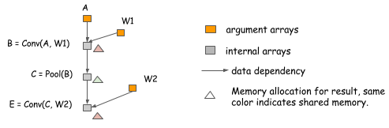

# 深度学习中的内存消耗优化

在过去的十年中，深度学习正朝着更深更大的网络延伸。除了硬件效率的提升。深度学习的边界切割模型不断压迫着CPU RAM的极限。所以到今天，总是希望发现使用更小的内存来构建更大的网络。这样做能让我们训练更快，使用更大的批大小和活的更高的GPU的使用率。

在这篇文档中，我们研究在深度学习中内存分配的技术。我们讨论了一些候选方案。虽然我们的建议并非详尽无遗，这些解决方案是有益的，并允许我们介绍主要的设计问题在发挥作用。

## 计算图

首先，让我们重温下计算图。在深度学习中一个计算图描述了计算之间的依赖关系。在图中的计算操作即可以是细粒度的也可以是粗粒度的。下面是两个计算图的例子。

在包类似于Theano和CGT中，计算图的概念是现式编码的。在其他的库中，计算图作为网络配置文件隐式的出现。在这些库中主要的差异是他们怎样计算剃度。这有两种主要的方式：在相同的图上执行反向传播或明确地表示反向路径以计算所需的梯度。

在Caffe、CXXNet、和Torch库中采用的是前者，在原始图上执行反向传播。CGT和Theano这样的库采用的是后者，显式的表示反向路径。在这里，我们采用的是显式后向路径方法，因为它有优化上有几个优势。

然而，我们应该强调的是选择使用显式后向路径方法并不意味着限制符号化库，例如Theano和CGT。我们也可以为基于层的剃度计算库使用显式后向路径方法。下图显示了这是如何做的。基本上，我们介绍了一个后向节点连接到连接到前向节点的图和调用layer.backward操作的后向计算。

这个讨论应用到了几乎所有已经存在的机器学习库汇总。

为什么显式的后向路径更好？ 让我们用两个例子来解释一下。第一个原因是显式后向路径清晰的描述了计算之间的依赖。考虑一下接下来的例子，我们从哪能获得关于A和B的梯度。从图中我们可以清晰的看到，d(c)的梯度的计算不依赖于F。这意味着当前向计算完成之后我们可以释放F的内存。相似的，C的内存也可以回收。

在这个例子中，B的输出涉及到两个计算。如果我们想在同样的网络中做梯度计算，我们需要引入一个显式的分割层。这意味着我们同样需要为前向传播进行分割。在这个图中，不包含一个分割层，但是在传播梯度到B之前这个图将自动插入一个图聚集节点。这帮助我们节省分配分割层的内存分配，以及节约在前向传播中的数据复制的计算消耗。

如果我们采用显式后向方法，在后向传播和前向传播之间没有差异。我们简单地按时间顺序计算计算图并进行计算。显式后向方法很容易分析。我们仅仅需要回答的问题：对于一个计算图的输出节点是怎样分配内存的？

## 什么可以被优化？

你可以看到，计算图是一个很有用的方式来讨论内存分配优化技术。我们已经展示了使用显式后向图怎样节省内存。现在让我们来探讨进一步的优化，看看我们如何确定基准的合理基线。

假设我们想做一个n层的神经网络。典型的，当执行一个神经网络时，我们需要为在BP期间使用的每层的输出和剃度值分配节点空间。当使用显式后向图方法时我们面临着同样的需求，因为在一个后向传播中节点的数量跟前向传播的数量大致相同。

### 就地计算

我们使用的一个最简单的技术是通过计算的就地内存共享。对于神经网络，我们通常可以将该技术应用于与激活函数相对应的操作。考虑接下来的案例，我们想要计算三个链接的sigmod函数的值。

因为我们可以地就算sigmoid值，为输入和输出使用同样的内存，我们可以使用恒定的内存计算任意长度的sigmoid函数连计算。

注意：当执行就地优化的时候容易出现错误。考虑接下来的例子，B的值不仅仅被C使用而且被F使用。

因为之后的C＝sigmoid(B)的计算仍然需要B的值，所以我们不能使用就地优化。为每个sigmoid计算简单的使用就地优化算法很容易掉入陷阱中，所以我们小心我们什么时候可以使用它。

### 标准化内存共享

就地计算不仅仅是一个共享内存的位置。在接下来的例子中，在计算完E后，B的值不在需要，我们可以重复使用B的内存来容纳E的结果。

内存共享不需要一致的数据形状。注意在之前的例子中，B和E的形状是不同的，为了解决这样的状态，我们能过分配B和E需要的最大内存大小并在他们之间共享。

### 真实神经网络分配的例子

当然，这仅仅是一个玩具例子，他们仅仅表达了前向传播的计算。但是同样的思想应用到真实的神经网络中。下图展示了二两感知机的分配计划。

在这个例子中：

 * 当执行 act1, d(fc1), out 和 d(fc2) 时应用了就地优化
 * 在d(act1) 和 d(A) 之间进行了内存共享。

## 内存分配算法

到目前为止，我们讨论了优化内存分配的传统技术。我们已经看到有陷阱要避免，正如在就地内存优化的例子中所展示的那样。所以，怎样我们才能正确的分配内存？这不是一个新问题。例如，在编译器中寄存器分配问题时非常相似的。我们可以借用这个技术。在这我们没有给出关于这个技术的回顾，但是引入了同样简单有效的解决这个问题的诀窍。

这个问题的关键时我们需要取代资源以至于他们相互之间不会发生冲突。更确切地说，每个变量都有自己的生命周期－从它开始计算到最后一个使用。在多层感知机的例子中，在计算完act1之后fc1的生命周期结束。

这个准则仅仅允许生命周期不重叠的变量间进行内存共享。这里有多种方式。