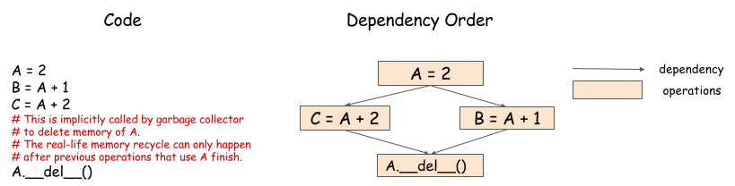
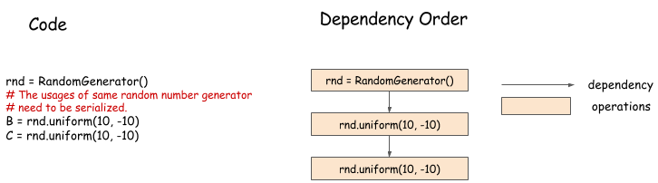
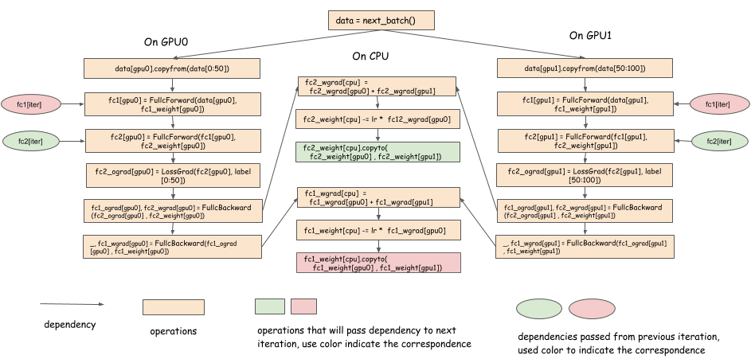
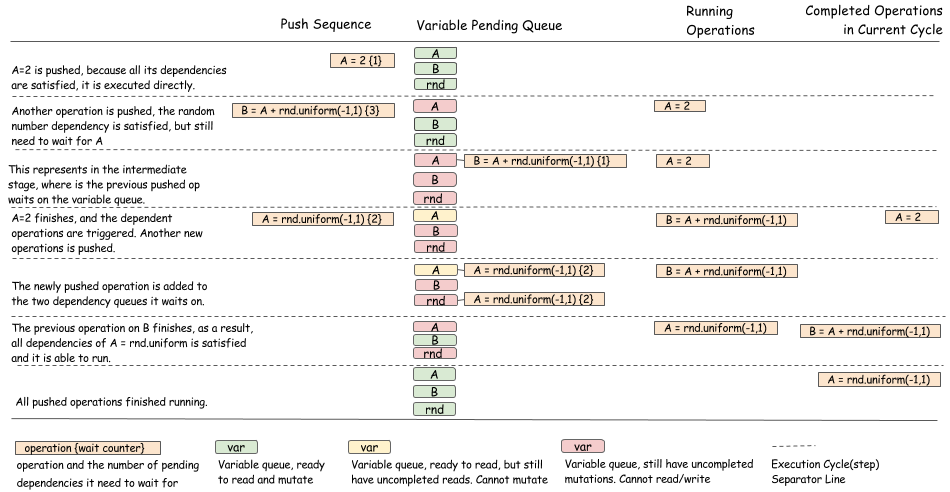

# 深度学习依赖引擎

我们总是希望深度学习库运行的更快，规模更大的数据集。一个传统的方法是看是否我们可以从使用更多硬件来获益，例如使用多GPU并行计算。

库设计者因此问：如果垮设备并行计算？更重要的是当引入多线程时，如何并行计算？一个运行时依赖引擎可以解决这些问题。

在这篇文章中，我们使用运行时依赖调度来加快深度学习。主要目的在于解释运行时依赖调度时怎样加速并简化了多设备深度学习的。我们还探索一种通用的依赖引擎的潜在设计，既可以是库的，也可以是操作无关的。

这篇文章的大部分讨论来自MXNet依赖引擎。讨论的主要依赖算法是由YantianLi 和 Mingjie Wang 开发的。

## Dependency Scheduling

尽管大部分用户想使用并行计算，但是我们大部分人更熟悉串行程序。所以一个很自然的问题：怎样写一个串行程序并构建一个库用异步的方式自动并行化我们的程序？

例如： 在接下来的代码中，我们能以任何顺序或并行的运行 B ＝ A ＋ 1 和 C ＝ A ＋ 2 。

```
    A = 2
    B = A + 1
    C = A + 2
    D = B * C
```

然而，因为最后一个操作 D ＝ B * C 在开始之前需要等待之前的操作完成，所以手工写代码是很困难的。接下来的依赖图／数据流图说明了这个问题。


一个依赖引擎是一个带有一系列操作和根据他们自身依赖模式进行调度的并行化库。所以在这个例子中，一个依赖性库可以并行运行 B＝ A ＋ 1和 C ＝ A ＋ 2 ，也可以在这些操作运行完成之后运行D ＝ B＊ C

## Problems in Dependency Scheduling

依赖引擎减轻了编写并发程序的负担。然而，当操作变成并行化之后，出现新的依赖性跟踪问题。在这一节中，我们来讨论这些问题。

## 数据流依赖性

数据流依赖描述了一个计算的输出是怎样被用来在另一个计算中的。每个依赖引擎必须解决数据流依赖问题。


我们接下来用同样的图来讨论这个问题。有数据流跟踪引擎的库包括 Minerva和Purine2.

## 内存回收利用

我们应该在什么使用回收利用分配给数组的内存？在串行程序中，这非常容易解决。当一个变量超出范围之后，我们简单的回收内存。然而，在接下来的图中显示的并行程序是比较困难的。



在这个例子中，因为两个计算都用到A的值，所有知道两个计算都结束之后我们才能回收内存。引擎必须根据依赖调度内存回收操作，并确保B ＝ A ＋ 1 和 C＝ A ＋ 2 执行王城之后才执行。

## 随机数生成

常常用于机器学习的随机数生成器，对于依赖引擎是一个挑战。考虑接下来的例子：



在这个例子中，我们按顺序生成随机数。尽管他能过并行的生成两个随机数，通常不是这样的。一个伪随机数生成器不是线程安全的，因为当生成一个新的数字的时候可能导致内部某些状态的改变。即使伪随机数生成器是安全的，最好序列化数生成，这样我们就可以得到可再现的随机数。

## 案例研究：一个多GPU神经网络的依赖引擎

在最后一节中，我们讨论在设计一个依赖性引擎是要面临的问题。在思考如何设计一个通用的引擎来解决这些问题之前，让我们来考虑一下一个依赖性引擎能过帮助一个神经网络的多GPU进行训练。接下来的python伪代码说明了训练一个两层的神经网络的一个批次。

```
    # Example of one iteration Two GPU neural Net
    data = next_batch()
    data[gpu0].copyfrom(data[0:50])
    data[gpu1].copyfrom(data[50:100])
    # forward, backprop on GPU 0
    fc1[gpu0] = FullcForward(data[gpu0], fc1_weight[gpu0])
    fc2[gpu0] = FullcForward(fc1[gpu0], fc2_weight[gpu0])
    fc2_ograd[gpu0] = LossGrad(fc2[gpu0], label[0:50])
    fc1_ograd[gpu0], fc2_wgrad[gpu0] =
      FullcBackward(fc2_ograd[gpu0] , fc2_weight[gpu0])
      _, fc1_wgrad[gpu0] = FullcBackward(fc1_ograd[gpu0] , fc1_weight[gpu0])
    # forward, backprop on GPU 1
    fc1[gpu1] = FullcForward(data[gpu1], fc1_weight[gpu1])
    fc2[gpu1] = FullcForward(fc1[gpu1], fc2_weight[gpu1])
    fc2_ograd[gpu1] = LossGrad(fc2[gpu1], label[50:100])
    fc1_ograd[gpu1], fc2_wgrad[gpu1] =
         FullcBackward(fc2_ograd[gpu1] , fc2_weight[gpu1])
         _, fc1_wgrad[gpu1] = FullcBackward(fc1_ograd[gpu1] , fc1_weight[gpu1])
    # aggregate gradient and update
    fc1_wgrad[cpu]  = fc1_wgrad[gpu0] + fc1_wgrad[gpu1]
    fc2_wgrad[cpu]  = fc2_wgrad[gpu0] + fc2_wgrad[gpu1]
    fc1_weight[cpu] -= lr *  fc1_wgrad[cpu]
    fc2_weight[cpu] -= lr *  fc2_wgrad[cpu]
    fc1_weight[cpu].copyto(fc1_weight[gpu0] , fc1_weight[gpu1])
    fc2_weight[cpu].copyto(fc2_weight[gpu0] , fc2_weight[gpu1])
```

在这个程序中，数据从0到50拷贝到CPU 0， 数据50 到 100 拷贝到 GPU 1， 剃度计算在CPU中聚合，表现为一个简单的SGD更新，拷贝更新后的权重到每个GPU中。这是一个常规的用串行的方式来写并行程序。接下来的依赖图展示了他是怎样并行化的。



*注意:*

* 当我们得到一层的剃度时，剃度可以被复制到CPU中
* 当权重更新时，权重可以被复制回去。
* 在前行传递中，我们依赖之前的迭代fc1 _ weight[cpu].copyto(fc1 _ weight[gpu0] , fc1 _ weight[gpu1])
* 在计算最后的后向传递到K层和下一个前向调用k层之间有一个延迟。我们可以在这个延迟中为并行计算中的其他计算同步k层的权重。

多GPU 深度学习库使用这种方法进行优化。重点是将权重同步（通信）与计算重叠。然而，这样做是很困难的。因为复制操作需要在层的反向传递完成后触发，然后触发还原、更新等。

一个依赖性引擎可以调度这些操作，采用多线程和依赖性追踪。

## 设计一个通用的依赖性引擎

我们希望你相信一个依赖性引擎对于将深度学习项目扩展到多个设备上是有用的。现在让我们来讨论一下为依赖性引擎怎样设计并执行一个通用接口。这个问题不仅仅是设计一个依赖引擎。这个例子我们认为是非常有用的。

我们的目标是创建一个通用的轻量级的依赖性引擎。理想情况下，我么希望这个引擎能够容易的塞入已有的深度学习代码，并能通过小量的改变就能扩展到多个机器上。要做到这一点，我们只需要关注依赖跟踪，而不是依赖于用户能够或不能做什么的假设。

这有一个对目标引擎的总结：

* 这个引擎不应该知道运算的操作是什么，以至于用户能过操作任何他们定义的运算。
* 它不应该限制那种对象能过调度。
	* 我们应该能过依赖GPU和CPU内存进行调度
	* 我们能过追中随机数生成器等。
* 这个引擎不应该分配资源。它仅仅追踪依赖。用户可以分配他们的内存，伪随机数等。

接下里的python片段提供了一个引擎接口能过帮助我们实现目标。值得注意的是，真实的实现通常使用C++实现的。

```
    class DepEngine(object):
        def new_variable():
            """Return a new variable tag
            Returns
            -------
            vtag : Variable Tag
                The token of the engine to represent dependencies.
            """
            pass

        def push(exec_func, read_vars, mutate_vars):
            """Push the operation to the engine.

            Parameters
            ----------
            exec_func : callable
                The real operation to be performed.

            read_vars : list of Variable Tags
                The list of variables this operation will read from.

            mutate_vars : list of Variable Tags
                The list of variables this operation will mutate.
            """
            pass
```

因为我们没有做关于什么样的对象我们可以调度的假设。我们请求用户来为相关的每个对象分配一个虚拟标签表示那个我们需要调度。所以，在一开始，用户能过分配虚拟标签，来关联我们想要调度的对象。


用户之后调用 push 方法告诉引擎执行函数。用户可需要使用 read_vars 和 write_vars 来具体化操作的依赖。
 
 * read_vars 对象变量标签读取操作，却不改变它的内部状态。
 * mutate_vars 对象变量标签，他的内部状态操作将发生改变。

 
 
这个过程图显示了是怎样把B ＝ A ＋ 1 推送到依赖性引擎的。 B.data 和 A.data 是被分配的空间。注意引擎仅知道变量标签。任何执行函数都能被处理。这个接口对于我们想要尽兴调度的计算和资源是可行的。
 
我们通过接来下的代码来思考下引擎内部是如何与标签一起工作的。
 
 ```
     B = A + 1
    C = A + 2
    A = C * 2
    D = A + 3
 ```
 
第一行读变量A和可变变量B。第二行读变量A和可变变量 C，等等。。
 
这个引擎为每个变量维持一个队列，下面的动画显示了四行中的每一行。绿色块表示读取动作，而红色块表示突变。
 
 
 
通过上面构造的队列，引擎认为在A队列开始出的前两个绿色块实际可以并行运行，因为他们都是可读动作，相互之间不存在冲突。接下来的图说明了这点。
 
 
 
一个非常酷的事情是这个调度对于数值计算是不确定的。因为每件事的调度仅需要一个tag，这个引擎能过调度所有事情。
 
接下来的图给我了我们之前章节中提到的完整的推送序列。
 
 
 
 
 ## 将现有代码一直到依赖引擎
 
因为通用接口不能控制类似于内存分配和什么操作去执行这样的事情，很多现有代码可以通过接下来的两步使用依赖性引擎进行调度。
 
* 分配和资源相关的变量标签，如内存 blob，伪随机变量
* 调用带有知性函数的push方法来初始化代码执行，把相关资源的变量标签正确的放入 read_vars 和 mutate_vars.

## 实现通用依赖引擎

我们已经描述了通用引擎接口以及怎样使用他们来调度各种操作。在这节中，我们提供一个如何实现这样引擎的一个高等级的讨论。

总体思想如下：

* 使用一个队列来追踪每个变量标签即将到来的依赖。
* 使用一个计数器在每个操作中来追踪还有多少依赖依旧存在。
* 当操作完成之后，更新队列状态和依赖计数器去调度新的操作。

接下来的图说明了调度算法以及让你更好的了解引擎中发生了什么。


接下来我们展示了一个随机数的例子。



正如你看到的，这个算法的目的是去更新队列中即将到来的操作和当一个操作完成之后的状态转换。应该更加小心地确保状态转换是以线程安全的方式完成的。

## 使用运行策略来独立依赖追踪

如果你读的非常仔细，你可能注意到之前的章节中展示的仅仅是一个操作什么时候会被执行的决策算法。我们没有展示如何实际运行这个操作。实际上有很多不同的策略。例如，我们即可以使用一个全局的线程池来运行所有的操作，也可以使用一个具体的线程来运行在每个设备上。

这些运行策略通常依赖与依赖追踪，即能独立出来作为一个独立的模块也可以作为一个基于依赖追踪的虚拟接口模块。开发一个对所有操作和调度公平的优雅运行时策略本身就是一个有趣的系统问题。

## 讨论

我们这篇文章中讨论的不仅仅是解决依赖追踪问题的设计。这只是我们如何接近这一点的一个例子。某些设计的选择是有争议的，我们在这一节讨论他们。

### 动态和静态

本主题中讨论的依赖引擎接口在某种程度上是动态的，用户可以逐个推操作，而不是声明整个依赖图（静态的）。由于数据结构，动态调度比静态声明需要更多的开销。当然它也能过更灵活。例如在命令式程序或者一个混和了命令式和符号式程序中支持自动并行化。你还可以向接口添加一些预声明操作，以实现数据结构重用。

### 可变 VS 不可变

通用引擎接口在这篇文章中支持显示的可变调度。在一个典型的数据流引擎中，数据通常是不可变的。处理不可变数据有很多益处。例如，不可变数据在并行化时更稳定，在分布式设置中有更好的容错性。

然而，不可变面临着几个挑战：

* 调度资源争用问题是困难的，如处理随机数和删除时出现的问题。
* 引擎通常需要管理资源（内存、随机数）避免冲突。更难插入用户分配的空间等
* 预分配静态内存时无效的。因为通常的模式是写入预先分配的层空间，如果数据是不可变的，则不支持该层空间。

