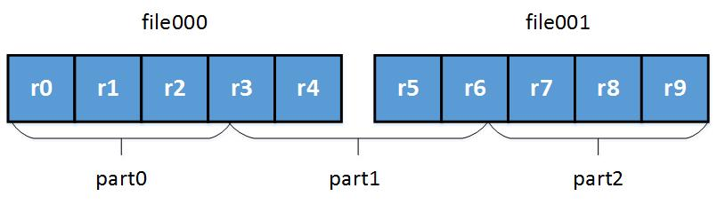
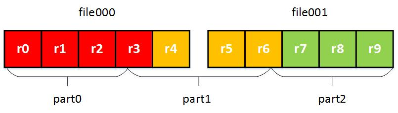
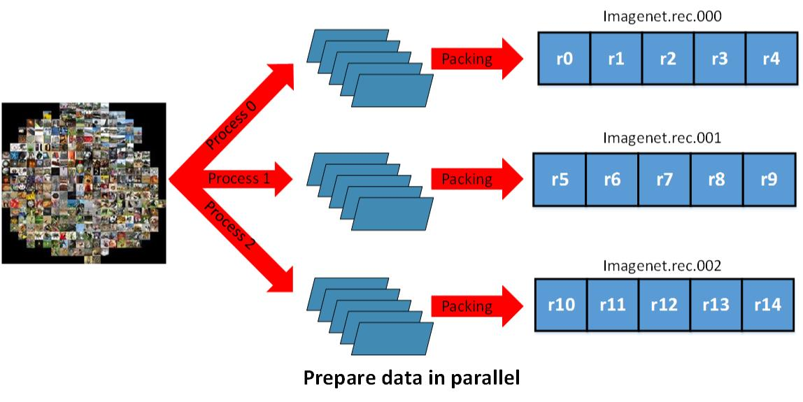
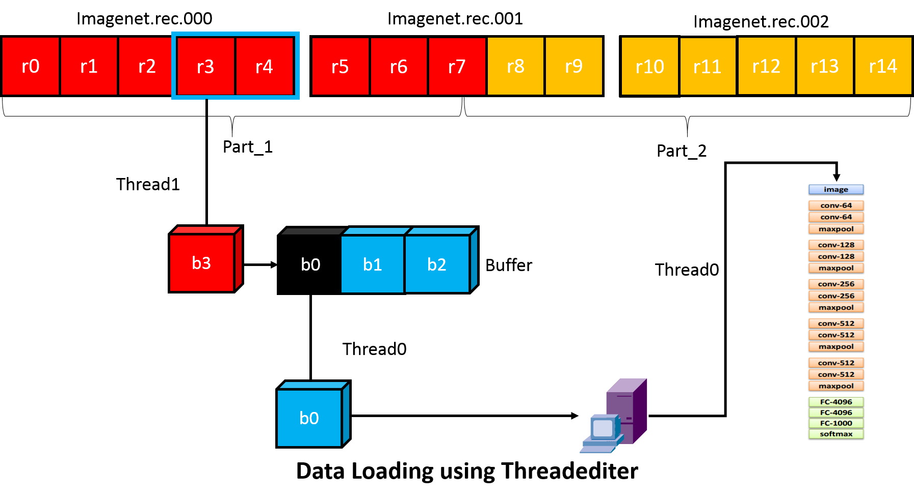

#为深度学习设计有效的数据加载器

对于任何机器学习系统，数据加载都是一个重要的组建。当我们在轻量数据集中工作时，我们加载所有数据集到GPU内存中。随着数据集的增加，我们必须在主内存中存储。当数据集增长太大主内存无法容纳时，数据加载变成一个关键性能。在设计一个数据加载器时，我们的主要目的是获取更有效的数据加载，花更少的精力在数据准备上，来表示一个简洁灵活的接口。

我们组织了这个设计笔记如下：

* IO 设计洞察力：数据加载设计中的设计原则
* 数据格式：我们的方案是使用 dmlc-core 的二进制 recordIO来执行。
* 数据加载：我们使用 dmlc-core 的线程迭代器来减少IO消耗。
* 接口设计：我们的方法是在Python的几行中方便地编写MXNET数据迭代器。
* 未来扩展：对于数据加载更佳灵活

我们的分析将激励一个有效的IO系统来满足若干需求。

* 小文件尺寸
* 并行（分布式）获取数据
* 快速数据加载，在线扩增
* 在分布式背景中，快速读取人一部分的数据集。

## 设计洞察力

设计一个IO系统，我们必须表述两种任务：数据准备和数据加载。数据准备经常是离线的，然而数据加载影响的是在线表现。在这节中，我们将介绍IO设计的两个阶段。

### 数据准备

数据准备描述了一个为之后的处理获取一个期望数据格式的一个过程。当伴随着像是ImageNet这样的数据集时，这个过程可能很耗时。在这些案例中，我们试着遵循几种启发式方法。

* 打包数据集进小量的文件中。一个数据集可能包含上百万的数据实例。从机器到机器分布式的打包数据集是非常容易的。
* 做一次打包。我们不想在每次运行时都要重复打包数据，比如机器数量改变。
* 并行处理打包来节约时间
* 能够容易的获取任意部分的数据集。当数据并行化被引入之后，对于分布式系统来说是至关重要的。当数据被打包进几个无力数据文件中时事情可能变的很滑稽。期望的行为是：打包的数据能过被逻辑的分割成任意数量的分区，不论物理数据文件有多少。例如，如果我们打包1000个图像进入4个物理文件，每个文件包含250个图像。之后我们使用10台机器来训练一个DNN，我们能过近似的每台机器加载100个图像。许多机器可能需要从不同的文件中获取图像。

## 数据加载

接下来的步骤是考了如果将打包好的数据加载进内存。我们的目标是尽可能快的加载数据。我们试着遵循几种启发式方法。

* 连续的读取：当从磁盘的连续位置读数据时，我们可以读的更快。
* 加少加载的字节： 用压缩的方式读区数据，比如 用JPEG格式保存图片
* 在不同的线程中加载和训练：这样可以避免由于加载数据导致的计算瓶颈
* 节省内存：明知的决定是否将整个文件加载进内存。

## 数据格式

因为训练神经网络经常涉及到大量的数据，我们选择的格式应该即高效又方便。为了获得这个目标，我们需要将一个二进制数据打包进一个可切割的格式。在MXNet中，我们依赖于dmlc-core中的二机制redocdIo格式来执行。


在MXNet 的二进制RecordIO 中，我们存储每个数据实例作为一条记录。kMagic 是一个表示一条记录开始的魔数。Lrecord 编码长度和一个连续标志。在lrecord中，

* cflag == 0: 这是一个完整的记录
* cflag == 1: 一个多条记录的开始
* cflag == 2: 多条记录的中间
* cflag == 3: 多条记录的结尾

Data 是一个保存数据内容的空间。Pad 是一个简单的扩充空间，是记录对齐到4个字节。

我们打包数据之后，每个文件包含多个记录。之后，加载可能是连续的。这避免了因为随机读区磁盘位置导致的低效性。

由记录来存储数据的一个优势是每条记录的长度是可变的。这允许我们当有一个很好的数据压缩算法时更简洁的保存数据。例如，我们能够使用JPEG格式来保存图像数据。打包的数据将比没压缩的RGB数据更小。

拿 ImageNet_1k 数据集作为例子。 如果我们存储的数据是3 * 256 * 256 的原RGB值的数组。数据集将多于200G。但是使用JPEG压缩图片之后，我们仅仅占用35G硬盘空间。这明显的降低了从磁盘读区的消耗。

这有一个关于二进制recordIO的例子：


我们首先重新设置了图像的大小为256 ＊ 256， 之后压缩为JPEG格式。之后，我们保存一个标头，该标头指示在构建该记录的数据字段时要使用的图像的索引和标签。我们之后将几个图像文件一起打包进一个文件。

## 获取任意部分数据

对于数据加载器的一个期望的特性是：被打包的数据能过逻辑的切割进一个任意数量的分区，无论有多少物理打包数据文件。尽管二进制recordIO能够使用魔数容易的分配一条记录的开始和结束。我们可以使用dmlc－core中的IputSplit函数来实现上面的目标。

InputSplit 带有接下来的参数：

* FileSystem filesys: dmlc-core 包装器为不同的文件系统提供io操作。像hdfs，s3，local等。使用者不必担心为不同系统而担心。
* Char uri: 文件的URI。注意他应该是所有文件的一个列表，因为我们可能将数据打包进几个物理部分。文件URI 用“;”分割.
* Unsigned nsplit: 逻辑分割数。 nsplit 可以不同于物理文件数量。
* Unsigned rank： 在这个过程中哪个split被加载。

一下表明了分割过程：

* 决定每个分区大小


* 根据文件大小的近似分区。注意，每个部分的边界可以位于记录的中间。



* 用同一种方式设置多个分区的开始避免切割记录扩多个分区。



通过以上操作，我们可以确定所有记录属于每个部分，物理文件内每个逻辑部分需要。InputSplit简化了数据并行化，每个数据仅仅读部分数据。

如下图所示，尽管我们的分区机制不依赖物理数据文件的数量，我们能过用并行的方式处理一个巨大的像是ImageNet_22k 这样的数据集。在准备时间我们不需要考虑分布式加载问题，仅仅根据数据集大小和计算资源有效性来选择最有效的物理文件数。



## 数据加载和预处理

当加载和预处理的速度与训练或验证的速度不一致时，IO将成为整个系统速度的瓶颈。子啊这节中，当加载和预处理被打包的二进制recordIO格式的数据时，我们将介绍几个技巧来获得更好的效率。当使用ImageNet数据集时，我们的方法在正常的HDD上IO速度是每秒3000张图片。

### 飞行中的加载和预处理

当我们训练神经网络时，我们有时必须同时对数据进行加载和预处理，原因如下：

* 当整个数据集超过了内存大小，我们不会提前加载。
* 有时，为了使模型对诸如平移、旋转和噪声的少量颜色偏移等具有鲁棒性，我们将随机性引入到训练过程中。在这些情况下，我们必须重新预处理数据，每次我们重新访问一个例子。

在服务的效率中，我们也表达了多线程技术。拿Imagenet训练作为一个例子，加载一批图片记录之后，我们开启多线程同步操作图片解码和图像扩长。我们在接下来的图中描述这一过程。


### 使用线程迭代器隐藏IO消耗

降低IO消耗的一个方法是用一个线程为下一个批次预取数据。尽管主线程为训练进行前后相计算。为了制成更佳复杂的训练机，MXNet提供了由dmlc－core提供的线程迭代器一种更普通的IO处理管线。线程迭代器的关键是开启一个单独的线程，作为一个数据提供者，而主线程作为一个数据消费者如下图所示。

线程迭代器维持一个恰当大小的缓冲区，当它不满时，自动填充缓冲区。当消费者完成在缓冲区中的部分数据时，线程迭代器将重复使用空间来保存下一部分的数据。



## MXNet IO python 接口 

我们将IO对象作为一个迭代器， 用户可以通过for循环或调用next() 函数容易的获取数据。在MXNet中定义一个数据迭代器和定义一个符号化计算器是相似的。

接下来的例子代码表明了一个Cifar数据迭代器。

```
dataiter = mx.io.ImageRecordIter(
    # Dataset Parameter, indicating the data file, please check the data is already there
    path_imgrec="data/cifar/train.rec",
    # Dataset Parameter, indicating the image size after preprocessing
    data_shape=(3,28,28),
    # Batch Parameter, tells how many images in a batch
    batch_size=100,
    # Augmentation Parameter, when offers mean_img, each image will subtract the mean value at each pixel
    mean_img="data/cifar/cifar10_mean.bin",
    # Augmentation Parameter, randomly crop a patch of the data_shape from the original image
    rand_crop=True,
    # Augmentation Parameter, randomly mirror the image horizontally
    rand_mirror=True,
    # Augmentation Parameter, randomly shuffle the data
    shuffle=False,
    # Backend Parameter, preprocessing thread number
    preprocess_threads=4,
    # Backend Parameter, prefetch buffer size
    prefetch_buffer=1)
   
```

通常，创建一个数据迭代器，你需要提供五种参数：

* Dataset Param: 获取数据集的信息。比如文件路径，输入形状
* Batch Param: 具体怎样形成一个批次，比如 批大小
* Augmentation Param: 在拿到一个输入图像时使用那种扩张操作。
* Backend Param: 控制后段线程的行为来隐藏数据加载消耗
* Auxiliary Param: 提供选项来帮助debug

通常，Dataset Param 和 Batch Param 必须给出，否则数据批次不能被创建。其他参数需要的时候给出。理想情况下，我们应该将MX数据IO分成模块，其中一些可能对用户公开是有用的。例如

* Efficient prefetcher: 允许使用者写一个数据加载器读二进制格式数据，自动获得多进程预加载器支持。
* Data transformer： 图像随机切割，翻转等。允许用户使用这些工具或植入他们自己的转换器。

